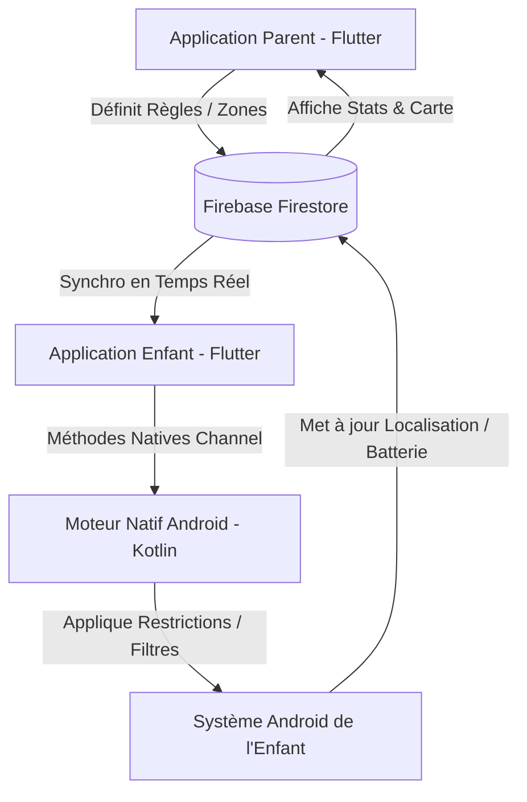

# 🛡️ The Guardian - Solution de Contrôle Parental Premium

**The Guardian** est une suite complète de contrôle parental moderne et sécurisée. Conçue avec une interface premium en glassmorphism et animée par un moteur de sécurité natif Android résistant au contournement, elle permet aux parents de protéger et d'accompagner leurs enfants dans leur vie numérique.

---

## 📐 Architecture Globale du Projet

Le projet est divisé en deux grandes parties collaborant en temps réel via un backend **Firebase (Firestore & Auth)** :



### 1. Application Parent (`ProjetforDefence-frontend`)
*   **Tableau de Bord Premium** : Visualisation en temps réel des statistiques d'utilisation, niveau de batterie, et de la position géographique de chaque enfant.
*   **Gestion des Règles** : Éditeur intuitif pour bloquer des applications spécifiques, des sites web ou configurer des limites de temps.
*   **Carte Temps Réel** : Intégration du SDK Google Maps pour le suivi en direct et la gestion des barrières virtuelles (Geofencing).
*   **Assistant IA** : Hub de discussion avec une IA pour aider les parents à analyser le comportement numérique et obtenir des conseils éducatifs.

### 2. Application Enfant (`ProjetforDefence-feature-child-app-restructuring`)
*   **Enregistrement Réseau** : Liaison sécurisée avec le compte parent via un jeton d'invitation à 6 chiffres.
*   **Service d'Arrière-plan Persistant** : Service natif pour remonter en continu la localisation géographique et l'état de l'appareil.
*   **Moteur d'Exécution Native** : Réceptionne les règles de blocage et les applique de manière stricte au niveau du système d'exploitation.

---

## ⚡ Moteur de Sécurité Natif (Android Engine)

Pour garantir que les restrictions ne puissent pas être contournées par l'enfant, **The Guardian** s'appuie sur des composants Android natifs écrits en **Kotlin** :

### 🛡️ 1. Service d'Accessibilité (`GuardianAccessibilityService`)
C'est le cœur du système de blocage de l'application. Il surveille l'activité de l'appareil en temps réel :
*   **Blocage d'Applications** : Détecte l'ouverture des applications interdites et affiche instantanément un écran de blocage.
*   **Filtrage Web en Temps Réel** : Inspecte la barre d'adresse des navigateurs majeurs (**Google Chrome**, **Samsung Internet**, **Firefox**) et bloque l'accès si l'URL saisie figure dans la liste noire des parents.
*   **Système d'Auto-Défense (Anti-Bypass)** : Intercepte les tentatives d'accès aux paramètres système Android (`com.android.settings`). Si l'enfant essaie de désactiver le service d'accessibilité ou de retirer les droits d'administration, l'accès à ces menus lui est instantanément refusé.

### 🔋 2. Optimisation des Performances (Cache Local)
Pour préserver l'autonomie du téléphone de l'enfant :
*   La liste des applications et des sites bloqués est stockée localement dans les `SharedPreferences`.
*   Le service d'accessibilité utilise un `OnSharedPreferenceChangeListener` pour charger ces règles en mémoire cache.
*   Aucun accès disque ou réseau n'est effectué lors de la navigation ou du lancement d'applications, garantissant **zéro ralentissement** et **zéro surconsommation de batterie**.

### 📱 3. Écran de Blocage Dédié (`BlockActivity`)
*   Lorsqu'une règle est enfreinte, le service d'accessibilité lance la `BlockActivity`.
*   C'est une activité Android native ultra-légère conçue pour s'afficher instantanément par-dessus l'application bloquée.
*   Elle neutralise le bouton "Retour" de l'appareil (`onBackPressed`), forçant l'utilisateur à retourner sur son écran d'accueil ou dans une zone autorisée.

### ⚙️ 4. Administrateur de l'Appareil (`GuardianDeviceAdminReceiver`)
*   Empêche la désinstallation non autorisée de l'application par l'enfant.
*   Protège le statut système du processus d'arrière-plan.

### 🏃 5. Service de Premier Plan (`GuardianForegroundService`)
*   Maintient l'application active en arrière-plan avec une notification persistante, empêchant le système Android de tuer le processus pour économiser de la RAM.
*   Gère la collecte de localisation GPS en tâche de fond.

---

## 🛠️ Configuration & Lancement

### Prérequis
*   **Flutter SDK** (dernière version stable)
*   **Android SDK** (API 26 minimum pour les services de premier plan)
*   Un projet **Firebase** configuré avec Firestore et Authentication.

### Installation et Démarrage rapide
1.  Récupérer le code source :
    ```bash
    git clone https://github.com/infinty170406/ProjetforDefence.git
    cd ProjetforDefence
    ```
2.  Installer les dépendances Flutter :
    ```bash
    flutter pub get
    ```
3.  Lancer l'application :
    ```bash
    flutter run
    ```

### Configuration des Permissions requises sur l'appareil Enfant
Pour que le système fonctionne, les permissions suivantes doivent être accordées manuellement lors du premier démarrage :
1.  **Service d'Accessibilité** : Pour l'analyse d'écran, le blocage des apps, le filtrage web et l'auto-défense.
2.  **Administrateur de l'appareil** : Pour interdire la désinstallation de l'application.
3.  **Localisation (Toujours autoriser)** : Pour permettre le geofencing et le suivi de position en arrière-plan.
4.  **Affichage par-dessus les autres applications** : Requis pour dessiner l'écran de blocage natif.
